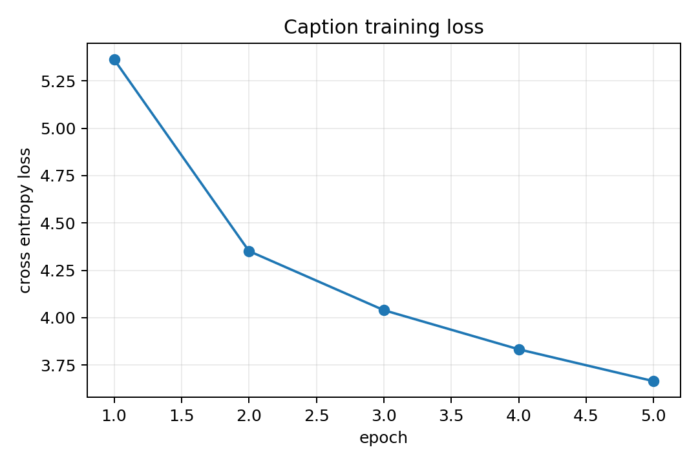
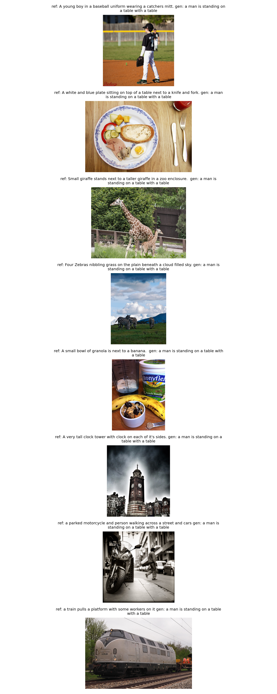

# DNN実践課題2 第7題: CNN+LSTMによるSentence Generation

## 1. 目的

画像キャプション生成は、入力画像から自然言語の説明文を生成する課題である。本実験では、COCOの画像とcaptionを用いて、CNN encoderとLSTM decoderからなる簡単なimage captioningモデルを学習した。

## 2. 方法

画像特徴の抽出にはImageNetで事前学習済みのResNet-18を用いた。ResNet-18の畳み込み部分で画像特徴を取り出し、全結合層でLSTMに入力する埋め込み次元へ変換した。decoderにはLSTMを用い、画像特徴を最初の入力として与え、その後に単語列を順に入力して次の単語を予測した。

データセットには研究室サーバ上のCOCO caption annotationを用いた。COCOはコピーせず、課題の指示通り `ln -s /export/data/dataset/COCO` でプロジェクト内にシンボリックリンクを作成して参照した。captionを小文字化し、英数字のtokenに分割して語彙を作成した。学習には5000個のimage-caption pairを用い、5 epoch学習した。損失関数にはCrossEntropyLossを用いた。

## 3. 結果

学習曲線を以下に示す。

生成例を以下に示す。

生成文の詳細は `data/generated_captions.csv` に保存した。学習結果の詳細は `data/training_metrics.csv` に保存した。

## 4. 考察

CNN+LSTMの構成では、CNNが画像の視覚特徴をベクトルとして表し、LSTMがその特徴をもとに単語列を生成する。画像分類とは異なり、出力が固定長のカテゴリではなく可変長の文になる点が特徴である。

ただし、今回のモデルは小規模で、学習に用いたcaption数も5000個に制限している。そのため、生成文はCOCO captionらしい短い表現には近づくが、画像中の細かい物体や関係を正確に説明するには不十分な場合がある。より自然なcaptionを生成するには、学習データを増やすこと、attention機構を使うこと、より強いCNN encoderやTransformer decoderを用いることが有効だと考えられる。

## 5. まとめ

COCO画像を用いてCNN+LSTMによるcaption生成を行った。CNNで画像特徴を抽出し、LSTMで単語列を生成することで、画像から説明文を作る基本的な流れを実装した。
