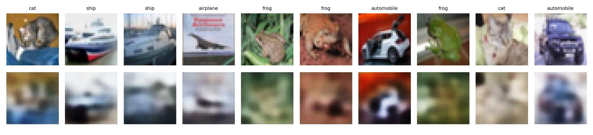
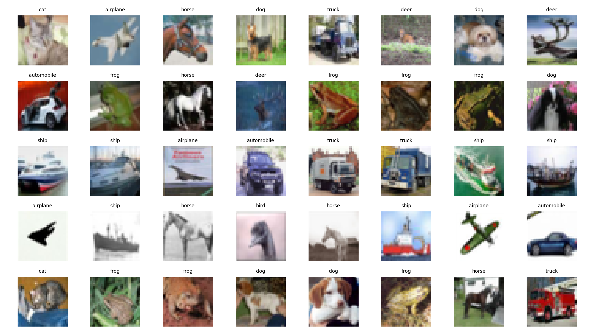
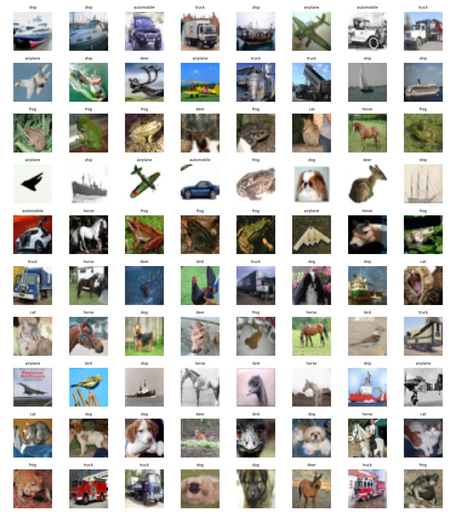
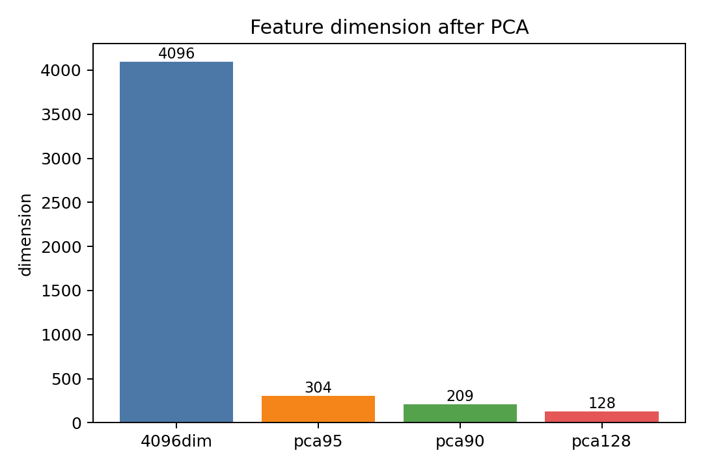
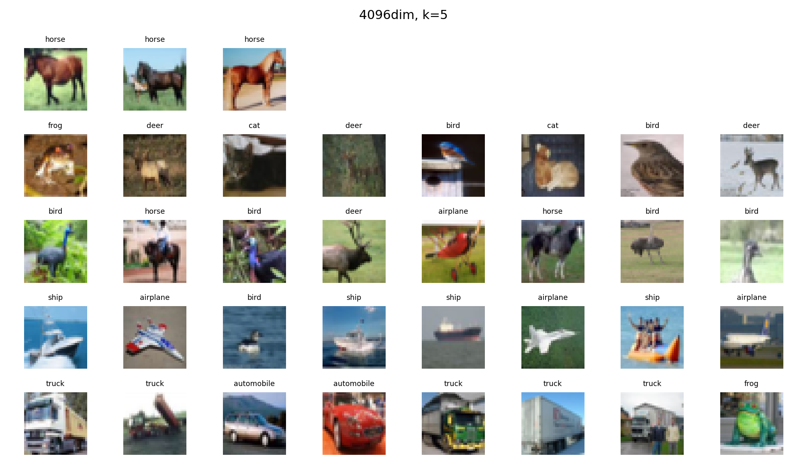
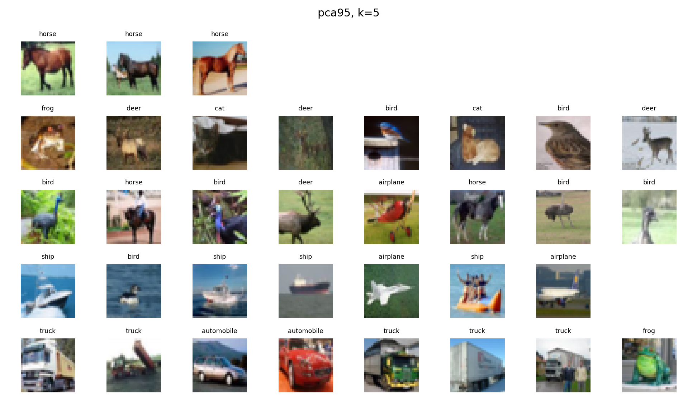
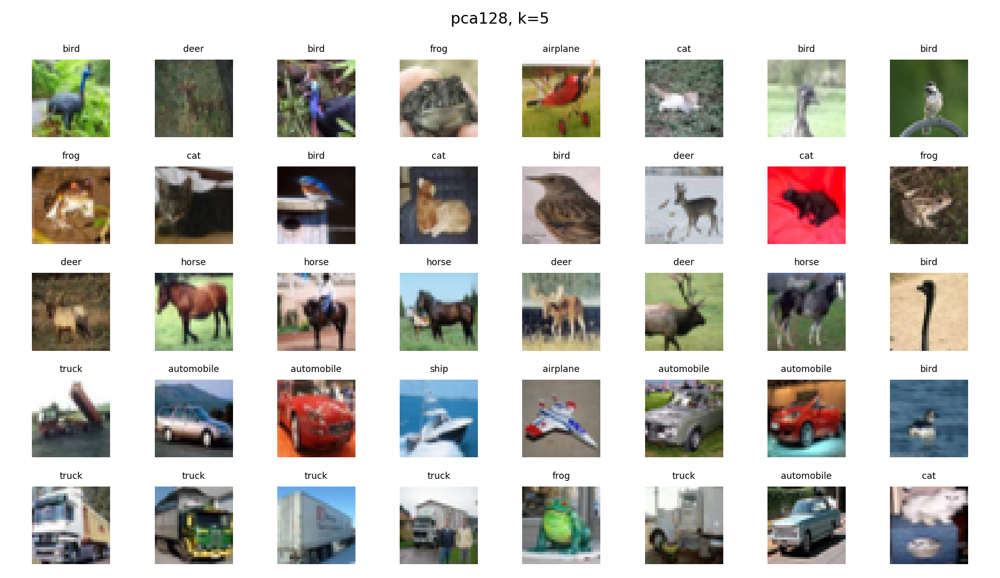
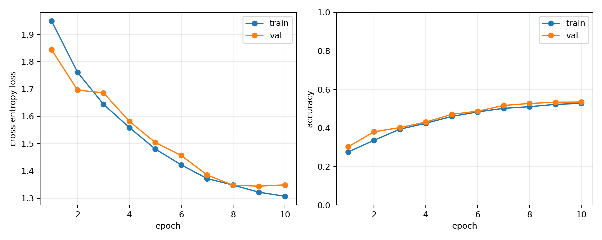
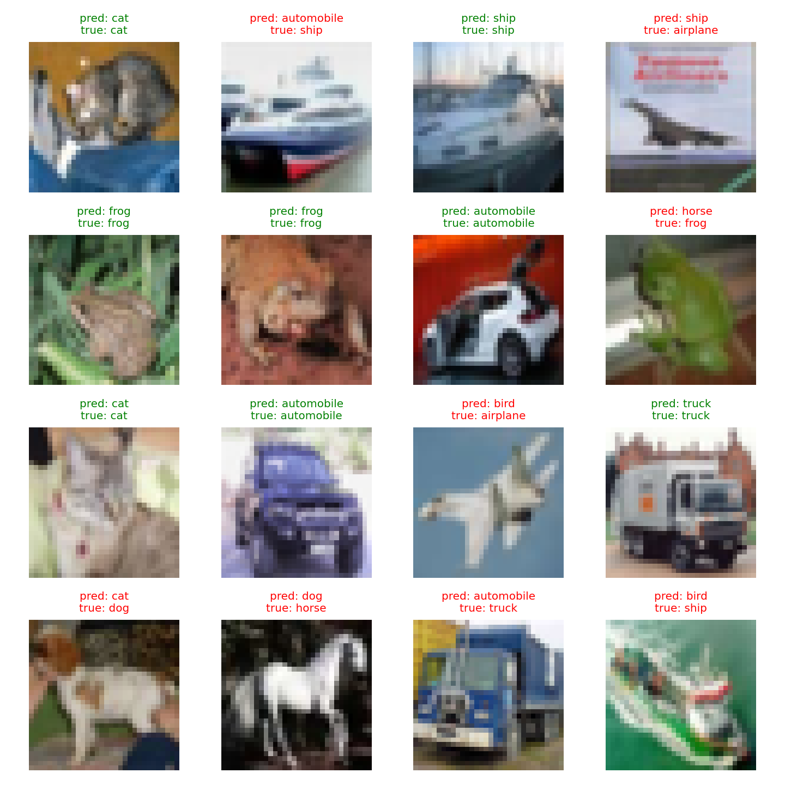

# DNN実践課題2 統合レポート

## はじめに

本レポートでは、DNN実践課題2で扱った7つのテーマについて、実装した内容と実験結果をまとめる。課題は、AutoEncoder、PCAによるDCNN特徴の次元削減、semantic segmentation、物体検出、Word2Vec、Vision Transformer、画像キャプション生成である。画像の復元、分類、検出、文生成など、入力と出力の形式が異なる課題を順番に試すことで、深層学習モデルがどのように特徴を表現し、別のタスクへ利用されるかを確認した。

## 1. AutoEncoderの学習

AutoEncoderは、入力画像をencoderで低次元のbottleneck特徴に圧縮し、decoderで元画像に近い画像へ復元するネットワークである。本実験ではCIFAR-10を用い、正解ラベルは使わず、入力画像そのものを教師信号として学習した。モデルは畳み込み層で画像を圧縮し、64次元のbottleneck特徴を経由して、転置畳み込み層で3x32x32の画像へ戻す構成にした。損失関数はMSE、optimizerはAdamを用いた。

学習MSEは1 epoch目の0.03347017から10 epoch目の0.00823573まで低下した。復元画像では、元画像の大まかな色や物体の位置は残っていたが、細かい輪郭や背景の模様はぼやけていた。これは、bottleneckで情報が圧縮されたためだと考えられる。

学習後、test画像から取り出した64次元のbottleneck特徴に対して、k-meansクラスタリングを行った。k=5では、ship, truck, airplane のように形や背景が近い画像が同じクラスタに入りやすかった。一方で、frog, cat, horse など異なるカテゴリも同じクラスタに混ざっていた。k=10ではより細かく分かれたが、CIFAR-10の10カテゴリと完全に対応するわけではなかった。

この結果から、AutoEncoderのbottleneck特徴には、復元に必要な色、形、構図の情報が含まれることが分かった。ただし、分類ラベルに合わせて学習しているわけではないため、クラスタリング結果は正解カテゴリとはずれる場合があった。

## 2. PCAによるDCNN特徴の次元削減

第2題では、ImageNetで学習済みのVGG16から得られる4096次元特徴をPCAで圧縮し、クラスタリング結果がどの程度変わるかを調べた。CIFAR-10画像を224x224 pixelにリサイズしてVGG16へ入力し、fc7層の4096次元特徴を取り出した。PCAは500枚の画像特徴で学習し、100枚を用いてk-meansクラスタリングを比較した。

PCA後の次元数は、累積寄与率95%で304次元、90%で209次元だった。128次元に固定した場合の累積寄与率は0.828331であり、元の特徴の分散を約82.8%保持していた。

k=5のクラスタリングでは、4096次元特徴とPCA 95%特徴の結果がかなり近かった。例えば、元の4096次元特徴でautomobileとtruckが多く集まったクラスタは、PCA 95%でもほぼ同じまとまりとして残っていた。また、bird, horse, deerが多いクラスタも、4096次元とPCA 95%で似た構成になった。

VGG16特徴はImageNetで学習された視覚的な情報を含むため、CIFAR-10に対しても見た目の近い画像を近い特徴として表せる。PCAで304次元まで圧縮してもクラスタリング結果が大きく崩れなかったことから、主要な情報は低次元にも残っていたと考えられる。一方で、128次元では累積寄与率が下がるため、細かいカテゴリ差は失われやすい。

## 3. UNetによるSemantic Segmentation

Segmentationは、画像全体に1つのラベルを付ける分類とは異なり、各pixelにカテゴリを割り当てる課題である。本実験では、研究室サーバ上のFoodSeg103を用いて、小さなUNetを学習した。入力画像はRGB画像、教師信号は `Images/ann_dir` のpixel label画像であり、どちらも128x128 pixelにリサイズして用いた。

モデルはEncoder-Decoder型のUNetである。Encoderでは畳み込みとmax poolingで特徴を取り出しながら解像度を下げ、Decoderでは転置畳み込みで解像度を戻した。さらに、Encoder側の特徴をDecoder側へ連結するskip connectionを使い、位置や輪郭の情報を戻しやすくした。損失関数はCrossEntropyLoss、評価指標はpixel accuracyとmean IoUとした。学習にはtrain splitから800枚、評価にはtest splitから200枚を用い、8 epoch学習した。

train lossは3.9939から1.9687へ、validation lossは3.4896から2.1297へ低下した。pixel accuracyは0.4193から最大0.5114まで上がり、最終epochでは0.4993だった。mean IoUは0.0300から0.0539まで上昇した。

予測結果を見ると、入力画像に対してmaskを出力する処理自体はできていた。ただし、mean IoUは0.05程度にとどまり、細かい食材領域や境界では誤りが多く残った。

FoodSeg103は103種類の食材カテゴリを含み、同じ皿の中で複数の食材が重なったり、境界が曖昧だったりする。今回のUNetは小さく、学習枚数とepoch数も制限したため、難しいカテゴリや細かい領域までは十分に学習できなかった。精度を上げるには、pre-trained backbone、data augmentation、class imbalanceを考慮したlossなどが必要になる。

## 4. Pre-trained Modelによる物体検出

物体検出は、画像中の物体カテゴリを分類するだけでなく、その位置をbounding boxとして推定する課題である。本実験では、torchvisionで提供されているCOCO事前学習済みのFaster R-CNN ResNet-50 FPNとSSDLite MobileNetV3を使い、研究室サーバ上のCOCO画像に対して推論を行った。COCOはコピーせず、課題の指示に従って `ln -s /export/data/dataset/COCO` で作成したシンボリックリンクから参照した。

Faster R-CNNは、まず候補領域を生成してから各候補を分類・回帰するtwo-stage detectorである。SSDLiteはone-stage detectorであり、特徴マップ上でbounding boxとカテゴリを直接予測する。一般に、Faster R-CNNは精度を重視し、SSD系のモデルは速度を重視した設計である。

Faster R-CNNでは、6枚の画像に対してそれぞれ5, 5, 2, 2, 1, 3個の物体がスコア閾値0.45以上で検出された。検出されたカテゴリには、car, suitcase, broccoli, bowl, orange, giraffe, vase, potted plant, zebra, umbrella, person が含まれていた。

SSDLiteでは、同じ6枚の画像に対してそれぞれ5, 4, 1, 2, 1, 2個の物体が検出された。主要なカテゴリはFaster R-CNNとほぼ共通していたが、giraffeやumbrellaのように複数の物体が写っている画像では、Faster R-CNNの方が検出数が多い場合があった。

今回の実験では追加学習は行わず、COCOで事前学習済みのモデルをそのまま使った。それでも、主要な物体は十分に検出できていた。一方で、検出できるカテゴリはCOCOで学習されたカテゴリに依存するため、COCOにない物体を扱うにはfine-tuningが必要になる。

## 5. Word2Vecによる単語ベクトル演算

Word2VecやGloVeなどの単語分散表現では、単語を高次元ベクトルとして表す。単語ベクトル空間では、意味が近い単語が近くに配置されるだけでなく、`king - man + woman = queen` のような演算が成り立つ場合がある。本実験では、gensim-dataで提供されている `glove-wiki-gigaword-50` を使い、近傍語検索と単語ベクトル演算を行った。

単語演算では、`positive_word - negative_word + add_word` の形でベクトルを計算し、cosine similarityが高い上位5語を取得した。7例中6例で期待した単語が上位5語以内に含まれた。

| formula | expected | top1 | hit top5 |
| --- | --- | --- | --- |
| king - man + woman | queen | queen | True |
| brother - man + woman | sister | daughter | False |
| paris - france + japan | tokyo | tokyo | True |
| rome - italy + france | paris | paris | True |
| berlin - germany + italy | rome | rome | True |
| better - good + bad | worse | worse | True |
| bigger - big + small | smaller | larger | True |

`king - man + woman` では `queen` がtop1となり、cosine similarityは0.8524だった。国と首都の関係では、`paris - france + japan` から `tokyo`、`rome - italy + france` から `paris`、`berlin - germany + italy` から `rome` がtop1として得られた。近傍語検索でも、`king` の近くに `prince`, `queen`, `emperor` が現れ、`computer` の近くに `software`, `technology`, `internet` が現れた。

一方で、`brother - man + woman` では期待した `sister` は上位5語に入らず、top1は `daughter` だった。家族関係語は文脈が近く、単純な性別変換としてはうまく出ない場合がある。また、`bigger - big + small` では `smaller` が上位5語に入ったものの、top1は `larger` だった。単語ベクトル演算は意味関係を捉える手がかりになるが、人間の論理そのものではなく、学習データ中の共起から得られた統計的な関係である。

## 6. Vision Transformer

Vision Transformer（ViT）は、画像を小さなpatchに分割し、それぞれのpatchをtokenとしてTransformer Encoderに入力する画像認識モデルである。本実験では、CIFAR-10を用いて小型ViTを学習した。入力画像は32x32 pixelで、4x4 pixelのpatchに分割したため、1枚の画像は64個のpatch tokenとして表現される。各patchを線形埋め込みし、class tokenとpositional embeddingを加えた後、Transformer Encoderへ入力した。

モデルは、embedding dimensionを128、Transformer Encoderの層数を4、attention head数を4とした。分類にはclass tokenの出力を用いた。optimizerはAdamW、学習率はcosine scheduleで変化させた。学習にはCIFAR-10のtrain splitから20000枚、評価にはtest splitから2000枚を用いた。

train lossは1.9486から1.3070へ低下し、train accuracyは0.2751から0.5274へ上昇した。validation側でも、val lossは1.8433から1.3488へ下がり、val accuracyは0.3020から0.5345へ上昇した。

最終的なval accuracyは約53.4%であり、CIFAR-10を高精度に分類できるほどではなかった。ただし、lossの低下とaccuracyの上昇から、patch tokenとclass tokenを用いた分類の仕組みは動作していることが分かる。ViTはCNNに比べて画像に対する帰納バイアスが弱いため、小規模データを一から学習する場合は高精度を出しにくい。より高い精度を目指すには、強いdata augmentationや事前学習済みViTのfine-tuningが必要になる。

## 7. CNN+LSTMによるSentence Generation

画像キャプション生成は、入力画像から自然言語の説明文を生成する課題である。本実験では、COCOの画像とcaptionを用いて、CNN encoderとLSTM decoderからなる簡単なimage captioningモデルを学習した。画像分類のように固定されたカテゴリを出すのではなく、画像特徴から単語列を出力する点が特徴である。

画像特徴の抽出には、ImageNetで事前学習済みのResNet-18を用いた。ResNet-18の畳み込み部分で画像特徴を取り出し、全結合層でLSTMに入力する埋め込み次元へ変換した。decoderにはLSTMを用い、画像特徴を最初の入力として与え、その後は単語を1つずつ入力して次の単語を予測した。COCOは第4題と同じく、`ln -s /export/data/dataset/COCO` で作成したシンボリックリンクから参照した。学習には5000個のimage-caption pairを用い、5 epoch学習した。

train lossは1 epoch目の5.3636から5 epoch目の3.6644まで低下した。lossが下がっているため、モデルはcaptionの単語列をある程度学習している。

一方で、生成文を見ると、8枚すべてに対してほぼ同じ文が出力された。野球少年、皿、キリン、シマウマ、時計塔、バイク、電車の画像に対しても、生成文は `a man is standing on a table with a table` に近い表現になった。

これは、学習に用いたcaption数を5000個に制限したこと、epoch数が5と少ないこと、decoderがattentionを持たない単純なLSTMであることが原因だと考えられる。画像特徴がLSTMの最初に一度入るだけなので、文を生成している途中で画像中のどの領域を見るかを切り替えることもできない。生成文が高頻度の定型文に偏った点は課題として残ったが、CNNで画像特徴を抽出し、LSTMで文を生成する基本的な流れは確認できた。

## 全体まとめ

7つの課題を通して、深層学習で使われる特徴表現の扱い方を幅広く確認した。AutoEncoderでは、正解ラベルなしでも復元を通して画像特徴を学習できることを見た。PCAでは、DCNNの高次元特徴を大きく圧縮しても主要な構造が残ることを確認した。SegmentationとDetectionでは、分類より細かい出力を扱う画像認識タスクを実装し、pixel単位の予測とbounding boxによる位置推定の違いを学んだ。

Word2Vecでは、画像以外のデータでもベクトル表現が意味関係を持つことを確認した。ViTでは、畳み込みではなくpatch tokenとself-attentionで画像分類を行う流れを実装した。最後のcaption generationでは、CNNで画像特徴を取り出し、LSTMで文章を生成する構成を試した。生成文は十分ではなかったが、画像から可変長の文を出力する難しさが分かった。

全体として、モデルの種類が変わっても、入力を特徴ベクトルやtokenとして表現し、それを目的に合わせて変換するという考え方は共通していた。一方で、分類、復元、検出、segmentation、文生成では、必要なデータ量、損失関数、評価指標、失敗の出方が大きく異なる。今回の実験は小規模な設定だったが、それぞれの手法の基本的な動作と限界を確認できた。
