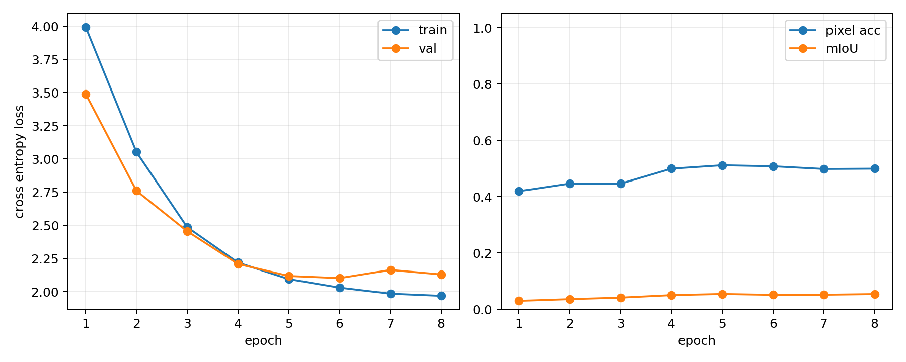
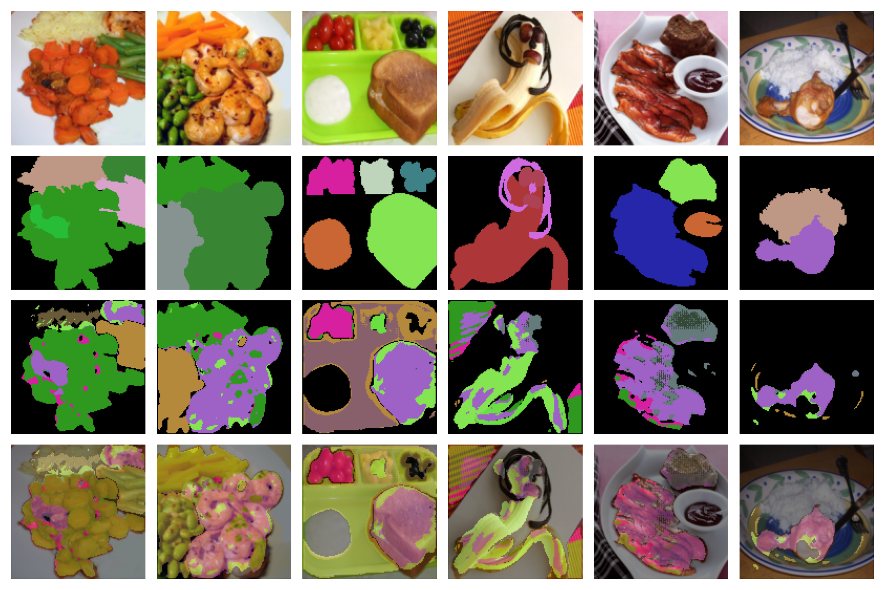

# DNN実践課題2 第3題: UNetによるSegmentation

## 1. 目的

Segmentationは、画像全体に1つのラベルを付ける分類とは異なり、各pixelにカテゴリを割り当てる課題である。本実験では、FoodSeg103データセットを用いてUNetを学習し、Encoder-Decoder型ネットワークによるpixel-wise predictionを試した。

## 2. 方法

入力画像にはFoodSeg103のRGB画像を用い、教師信号には `Images/ann_dir` のpixel label画像を用いた。入力画像とmaskは128x128 pixelにリサイズした。maskでは各pixelが背景または食材カテゴリのいずれかを表すため、モデルは各pixelに対して多クラス分類を行う。

モデルには小さなUNetを用いた。Encoderでは畳み込みとmax poolingで特徴を取り出しながら空間解像度を下げ、Decoderでは転置畳み込みで解像度を戻した。さらに、Encoder側の特徴をDecoder側へ連結するskip connectionを使い、位置や輪郭の情報を戻しやすくした。

損失関数にはCrossEntropyLossを用い、評価指標としてpixel accuracyとmean IoUを計算した。学習にはtrain splitから800枚、評価にはtest splitから200枚を用い、8 epoch学習した。

## 3. 結果

学習曲線を以下に示す。

予測結果を以下に示す。上から順に、入力画像、正解mask、予測mask、予測maskを入力画像に重ねたoverlayである。

train lossは1 epoch目の3.9939から8 epoch目の1.9687まで低下した。validation lossも3.4896から2.1297まで下がった。pixel accuracyは0.4193から最大0.5114まで上がり、最終epochでは0.4993だった。mean IoUは0.0300から0.0539まで上昇した。

予測maskを見ると、入力画像に対してmaskを出力する処理自体はできている。ただし、mean IoUは0.05程度にとどまり、細かい食材領域や境界では誤りが多く残った。

## 4. 考察

UNetはEncoder-Decoder構造を持つため、画像全体の文脈を見ながら、入力と同じ解像度のmaskを出力できる。skip connectionによって浅い層の位置情報をDecoderに渡せるので、輪郭を戻しやすい点もUNetの特徴である。

今回の結果では、lossの低下とpixel accuracyの上昇から、モデルがFoodSeg103のsegmentationをある程度学習したことは分かる。一方で、mean IoUは低かった。FoodSeg103は103種類の食材カテゴリを含み、食材同士の境界もはっきりしない場合がある。同じ皿の中に複数のカテゴリが細かく混ざることもあり、小さなモデルではかなり難しい。

今回使ったUNetは小さく、学習枚数も800枚、epoch数も8に制限した。精度を上げるには、より大きなUNetやSegNet、pre-trained backbone、data augmentation、class imbalanceを考慮したlossを試す必要がある。

## 5. まとめ

FoodSeg103を用いてUNetによるsemantic segmentationを行った。train lossは3.9939から1.9687へ低下し、pixel accuracyも約0.42から約0.50へ上昇した。mean IoUは低かったが、各pixelに対して多クラス分類を行い、入力画像と同じ解像度のmaskを出力する流れは実装できた。
